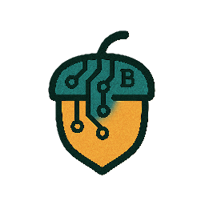

# BitNut

A fun little experiment to make a bitnet-based llm that talks like a dog who believes the world is run by squirrels.

# corpus

In pre-training, used the cosmopedia-v2 from 
https://huggingface.co/datasets/HuggingFaceTB/smollm-corpus 

# architecture

Just took the design from here and stripped it down to an even smaller model: https://huggingface.co/microsoft/bitnet-b1.58-2B-4T

# setup

PyTorch with cuda support:
pip3 install torch torchvision torchaudio --index-url https://download.pytorch.org/whl/cu124

Bitnet's transformers (https://github.com/shumingma/transformers):
pip3 install git+https://github.com/shumingma/transformers.git

pip3 install hf_xet
pip3 install -r requirements.txt

# steps

1. train_tokenizer.py (let's make our own tokenizer...because we can.)
2. pretrain.py (Give us a base model. This will download a huge amount of data. I hope you have disk.)
3. run-pretrain.py (should be able to see the base model works, even if it's not great.)
4. generate_prompts.py (Before we can fine tune, we need a bunch of example prompts.) 
5. apply_bitnut_voice.py (make finetuning training data, with responses to the prompts in bitnut's voice.)
6. finetune.py (Make a finetuned model with bitnut's voice.)
7. run.py (chat with bitnut)